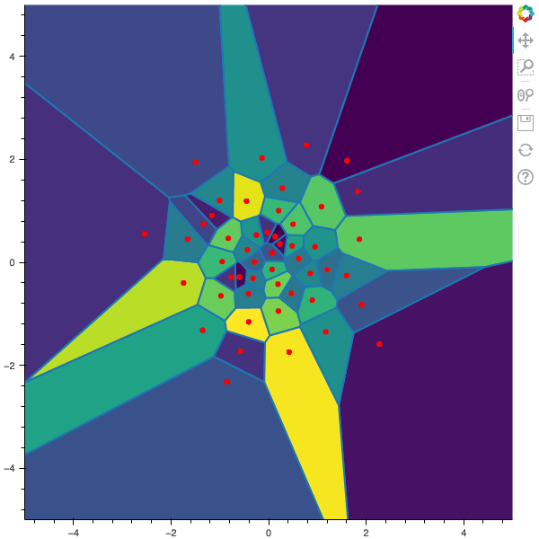

stochastic-methods-optimal-quantization
======

This repository contains the code explained in the following blog posts:
- [Stochastic Numerical Methods for Optimal Voronoï Quantization](http://montest.github.io/2022/02/13/StochasticMethodsForOptimQuantif/) 
The two main methods are in the files ``lloyd.py`` and ``clvq.py``.
- [Optimal Quantization with PyTorch - Part 1: Implementation of Stochastic Lloyd Method](http://montest.github.io/2023/03/16/StochasticMethodsForOptimQuantifWithPyTorchPart1/) 
The two main methods are in the files ``lloyd_optim.py`` and ``lloyd_pytorch.py``.


Requirements `python 3.9`

``pip install -r requirements.txt``




Useful from Google Colab
-------------

```
import os
import sys
import shutil

if os.path.exists('stochastic-methods-optimal-quantization'):
  shutil.rmtree('stochastic-methods-optimal-quantization')
!git clone -b pytorch_implentation_dim_1_clvq https://github.com/montest/stochastic-methods-optimal-quantization.git
sys.path.append('stochastic-methods-optimal-quantization')
```

```
 #! /bin/bash
apt update
apt install python3-pip
git clone -b pytorch_implentation_dim_1_clvq https://github.com/montest/stochastic-methods-optimal-quantization.git
cd stochastic-methods-optimal-quantization
pip3 install -r requirements.txt
```